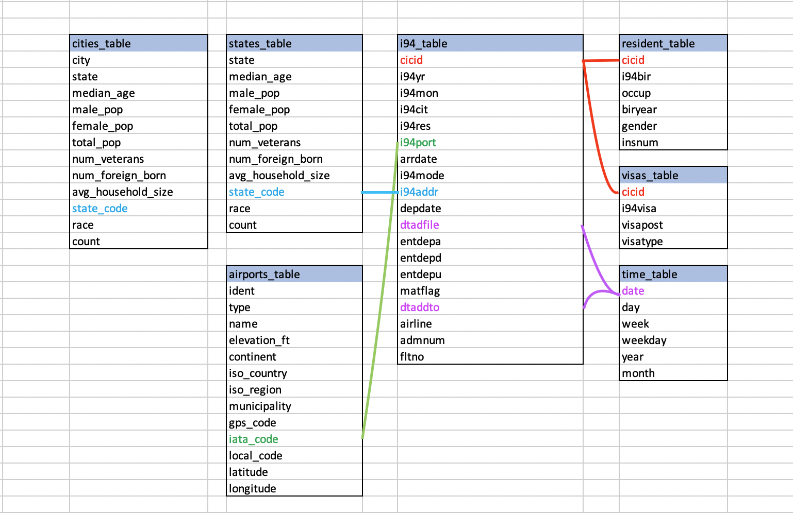

# Project Write-Up
## Goal
The goal of this project was to create an optimized database for i94 immigration data. US demographic data and airport data has also been inluded for enhanced analysis. 

For example, an analyst may be viewing i94 data records and wishes to learn more about the airports listed within the records. To find this informaton, the analyst may join the i94 records table with the airports table like so:
```sh
SELECT * FROM i94_table_parquet i 
join airports_table_parquet a
    ON i.i94port = a.iata_code
```

Or perhaps the analyst would like to know more about the demographics of the states listed within the i94 records. They may join the i94 records table to the states table like so:
```sh
SELECT * FROM i94_table_parquet i 
join states_table s
    ON i.i94addr = s.state_code
```

To achieve this goal, the data model is as follows:



- **i94_table**: i94 arrival/departure records
- **resident_table**: residents who have immigrated to the US
- **visas_table**: data about residents' visas
- **airports_table**: detailed information on airports
- **states_table**: demographics at the states level
- **cities_table**: demographics at the city level
- **time_table**: time table for incorporating other date fields

For a detailed breakdown of the schema, refer to data_dictionary.xlsx 

## Tools and Technologies
- **Spark** for data processing and building the ETL. Spark was chosen so that parallel computing could be leveraged as it is a tool for handling Big Data, allowing scalability. In addition, Spark is very flexible to work with as it has many useful data processing functions as well as a SQL interface.
- **Amazon S3** for securely storing the transformed data, which is in the form of .parquet files 
- **Amazon Glue** for stitching together the .parquet files into data tables via a Glue Crawler
- **Amazon Athena** for querying and interacting with the finalized data tables
## Spark ETL Process
**Step 1:** Load the source data from S3
- airport-codes_csv.csv
- sas_data (folder containing .parquet files of i94 data)
- us-cities-demographics.csv

**Step 2:** Transform and process the data into new data model

**Step 3:** Load the newly created tables back into S3 as .parquet files

**Step 4:** Perform data quality checks

**Step 5:** Use Amazon Glue to run a Glue Crawler over S3 and stitch the .parquet files into a database

**Step 6:** The data is now ready for quering in Amazon Athena

## Scenarios
### The data was increased by 100x.
Because I have chosen to use Spark for processing the data, which is designed to handle Big Data by leveraging parallel computing and map reduce, I may have to increase the amount of compute resources within the Spark cluster. However, if I implement a Spark cluster via Amazon EMR, then the resources will auto-scale as needed.
### The pipelines would be run on a daily basis by 7 am every day.
To automate this scheduling process in a robust manner, I would incorporate the Spark ETL I have developed into Apache Airflow. I would create a new DAG where each DAG task is a step in the Spark pipeline. Also, the Glue Crawler will need to be re-ran over the S3 bucket that contains generated parquet files in order to update the database. This can be achieved in an automated manner as well by executing the Glue Crawler with the AWS Python API within the DAG.
### The database needed to be accessed by 100+ people.
Because this database is hosted on AWS via Amazon Athena, it will auto-scale as needed in order to server users.
